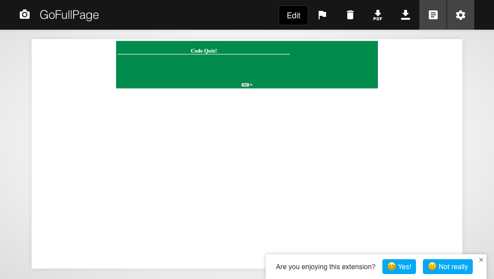

## Code Quiz

AS a coding boot camp student I wanted to create a timed quiz on JavaScript fundamentals that stores high scores
SO THAT I can gauge my progress compared to my peers

## Installation
Created by me using VS Code.

## Link to the site
https://starkoiii.github.io/code-quiz2/

## Link to site repository
https://github.com/Starkoiii/code-quiz2

## Screenshot of the site

## Accessibility/Grading Requirements 
GIVEN I am taking a code quiz
WHEN I click the start button
THEN a timer starts and I am presented with a question
WHEN I answer a question
THEN I am presented with another question
WHEN I answer a question incorrectly
THEN time is subtracted from the clock
WHEN all questions are answered or the timer reaches 0
THEN the game is over
WHEN the game is over
THEN I can save my initials and my score

## Usage
This page allows users to test a functional test!

## How to contribute
Willing to accept any constructive criticism to improve my future projects or current projects improvements in functionality or style!

© 2023 Starkoiii Coding Confidential and Proprietary. All Rights Reserved.
